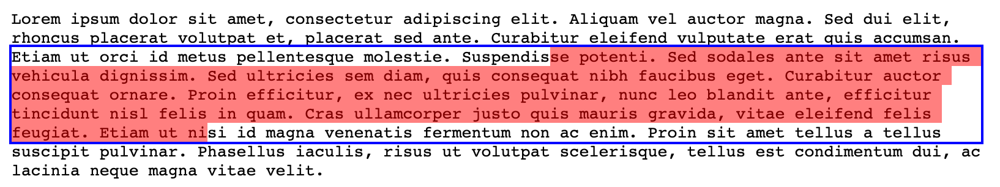

# `InputRange`

The [`Range`](https://developer.mozilla.org/en-US/docs/Web/API/Range) web API provides access to a slice of a document, including some very useful functions for obtaining the coordinates of the contents of that slice (`getClientRects` and `getBoundingClientRect`).

These _could_ be extremely powerful when used in tandem with form input fields as they can allow for annotating text without having to wrap it in a `span`. Unfortunately, the contents of `<input>` and `<textarea>` elements remain inaccessible to this API because they are not rendered like regular `Text` nodes.

This library aims to provide a solution to that through a new [`InputRange`](https://iansan5653.github.io/dom-input-range/classes/InputRange.html) class that implements a subset of the `Range` API.



## Usage

Install the package:

```sh
npm install dom-input-range
```

A new `InputRange` can be [constructed](https://iansan5653.github.io/dom-input-range/classes/InputRange.html#constructor) with an element and offsets. For example, to get the coordinates of the bounding box around the first ten characters of a `textarea`:

```js
import { InputRange } from "dom-input-range";

new InputRange(element, 0, 10).getBoundingClientRect();
```

There is also a convenient [`fromSelection`](https://iansan5653.github.io/dom-input-range/classes/InputRange.html#fromSelection) method for creating a range from the active selection. This can also be used to get the coordinates of the caret:

```js
import { InputRange } from "dom-input-range";

InputRange.fromSelection(element).getClientRects();
```

For the full api, see the docs for [`InputRange`](https://iansan5653.github.io/dom-input-range/classes/InputRange.html).

## Demos

- [Words](https://iansan5653.github.io/dom-input-range/demos/words/): Highlight certain words in an input as the user types
- [Caret](https://iansan5653.github.io/dom-input-range/demos/caret/): Show an indicator wherever the caret is located
- [Playground](https://iansan5653.github.io/dom-input-range/demos/playground/): Play with a `<textarea>` to see the difference between [`getBoundingClientRect`](https://iansan5653.github.io/dom-input-range/classes/InputRange.html#getBoundingClientRect) and [`getClientRects`](https://iansan5653.github.io/dom-input-range/classes/InputRange.html#getClientRects)

## Available features and limitations

This API is focused on providing an intuitive way to obtain the coordinates of text inside a form field element. It also implements a few other `Range` methods for consistency with the browser API, but it does not implement the entire class:

- All methods for querying information about the range are implemented
- This `InputRange` cannot cross `Node` boundaries, so any method that works with `Node`s is not implemented
- Two new manipulation methods are present instead: [`setStartOffset`](https://iansan5653.github.io/dom-input-range/classes/InputRange.html#setStartOffset) and [`setEndOffset`](https://iansan5653.github.io/dom-input-range/classes/InputRange.html#setEndOffset)
- Methods that modify the range contents are not implemented - work with the input `value` directly instead

## `InputStyleClone` low-level API

Behind the scenes, `InputRange` works by creating a 'clone' element that copies all of the styling and contents from the input element. This clone is then appended to the document and hidden from view so it can be queried. This low-level API is exposed as [`InputStyleClone`](https://iansan5653.github.io/dom-input-range/classes/InputStyleClone.html) for advanced use cases:

```ts
const clone = new InputStyleClone(input)
clone.element.getBoundingClientRect()
```

Mounting a new element and copying styles can have a real performance impact, and this API has been carefully designed to minimize that. You can use `InputStyleClone.for` to share a single default clone instance for the lifetime of an input, **if you only plan to query and not mutate the clone element**:

```ts
const sharedClone = InputStyleClone.for(input)
clone.element.getBoundingClientRect()
```
